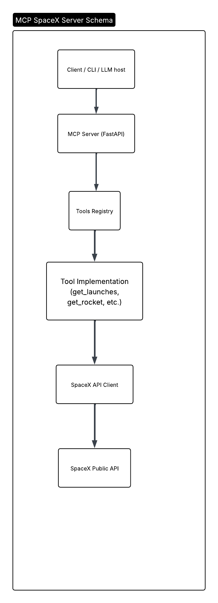
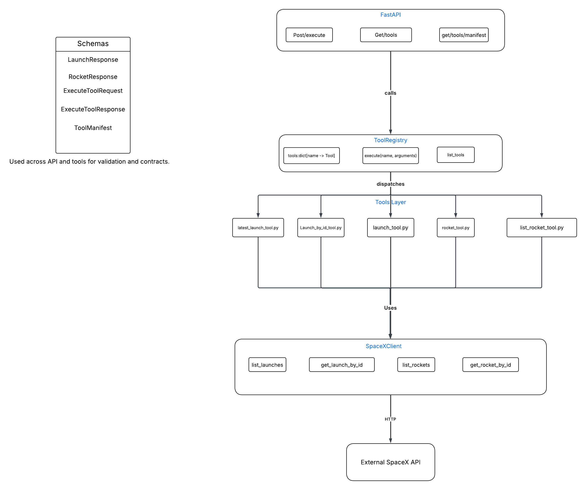

## MCP SpaceX Server — Design Document

### Version: 1.0
### Date: 2026-02-25
## Table of Contents
1. [Overview](#1-project-overview)
2. [Architecture](#2-architecture-overview)
3. [Execution Flow](#3-execution-flow)
4. [Tool System](#4-tool-system)
5. [Tool Manifest System](#5-tool-manifest-system-)
6. [Module Structure](#6module-structure)
7. [Data Handling](#7-data-handling)
8. [Testing Strategy](#8-testing-strategy)
9. [Setup and Running](#9-setup--running)
10. [Future Improvements](#10-future-improvements)
11. [Design Principles Applied](#11-design-principles-applied)  

#### 1. Project Overview
This project implements a lightweight RPC-style MCP server that exposes structured tools for retrieving data from the public SpaceX API.  
Instead of traditional REST resource endpoints (e.g., /launches), the server follows a Remote Procedure Call (RPC) pattern.  
Clients invoke tools dynamically via a single execution endpoint.

**The project demonstrates:**

* RPC-based tool execution 
* Clean layered architecture 
* Dependency injection 
* Pydantic-based validation 
* Tool discovery via structured manifests 
* Unit-tested business logic

#### 2. Architecture Overview
The system follows a layered architecture with strict downward dependencies.  


**Layer Responsibilities**


Dependencies flow strictly downward. No circular coupling.

#### 3. Execution Flow
1. Client sends a POST request to `/execute`.
2. The request contains:
   * `tool` (string)
   * `arguments` (object)
3. FastAPI validates the request using `ExecuteToolRequest`.
4. ToolRegistry locates the tool by name.
5. The selected tool executes business logic.
6. SpaceXClient performs the external API request.
7. The tool returns validated Pydantic models.
8. Registry wraps the result in `ExecuteToolResponse`.
9. JSON response is returned to the client.
This follows an RPC-style execution model.

#### 4. Tool System
The server currently exposes the following tools:
* list_launches 
* get_launch_by_id 
* get_latest_launch 
* list_rockets 
* get_rocket_by_id

**Each tool:**
* Accepts SpaceXClient via dependency injection 
* Exposes a single async execute(arguments: dict) method 
* Performs input validation if required 
* Returns Pydantic models 
* Is registered in ToolRegistry 
* Has a corresponding structured manifest

#### 5. Tool Manifest System  
Each tool is described via a structured manifest containing:
* `name` 
* `description` 
* `parameter schema` (JSON-schema style)

**Manifests allow:**  
* Tool discovery (GET /tools)
* Structured metadata access (GET /tools/manifests)
* Future AI/LLM integration

**Example manifest structure:**  
### Example manifest structure

```json
{
  "name": "get_launch_by_id",
  "description": "...",
  "parameters": {
    "type": "object",
    "properties": {
      "launch_id": {
        "type": "string",
        "description": "SpaceX launch ID"
      }
    },
    "required": ["launch_id"]
  }
}
```

#### 6.Module Structure

```
src/
├── main.py
├── registry.py
├── schemas.py
├── spacex_client.py
└── tools/
    ├── launch_tool.py
    ├── launch_by_id_tool.py
    ├── latest_launch_tool.py
    ├── rocket_tool.py
    └── rocket_list_tool.py
tests/
├── test_launch_by_id_tool.py
├── test_latest_launch_tool.py
└── test_registry.py
```

#### 7. Data Handling
* No persistent storage 
* All data retrieved live from SpaceX public API 
* Data validated using Pydantic models 
* Transient in-memory processing only

#### 8. Testing Strategy
**Unit tests cover:**
* Tool logic (success and validation errors)
* Registry dispatch behavior 
* Error handling

**Tests are written using:**
* pytest 
* pytest-asyncio 
* mocked SpaceXClient

No external API calls are performed during unit testing.

Run tests:
```bash
  uv run pytest
```

#### 9. Setup & Running
Requirements
* Python 3.12+ 
* uv package manager

Install dependencies
```bash
  uv sync
```

Run server
```bash
  uv run uvicorn main:app --reload
```

Access:
* Root: http://127.0.0.1:8000/
* Swagger UI: http://127.0.0.1:8000/docs
* Tool list: http://127.0.0.1:8000/tools
* Tool manifests: http://127.0.0.1:8000/tools/manifests

#### Execute example:
```bash
curl -X POST http://127.0.0.1:8000/execute \
     -H "Content-Type: application/json" \
     -d '{
       "tool": "list_rockets",
       "arguments": {}
     }'
```

#### 10. Future Improvements
* Add caching (TTL-based in-memory cache)
* Add retry with exponential backoff 
* Add rate-limit handling 
* Introduce structured logging 
* Add CI pipeline 
* Extend tool set (payloads, missions, crew)

#### 11. Design Principles Applied
* Single Responsibility Principle 
* Dependency Injection 
* Clean Layered Architecture 
* RPC-style tool execution 
* Explicit schema validation 
* Testable isolated components  
